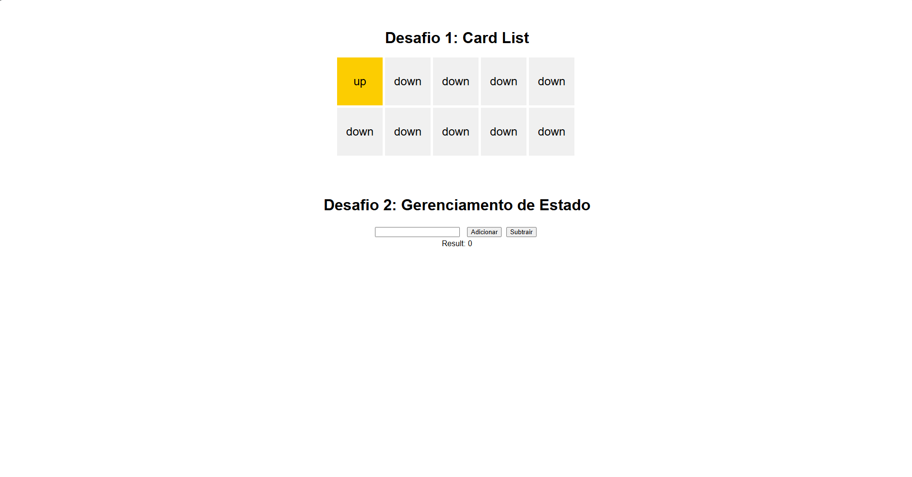

# Zénigma Front-End Challenge

Implementation of two small challenges using React + TypeScript.



## About

Project includes:

1. Card List: a list of 10 cards where only the clicked one stays in the "up" state.
2. State Management: a counter with increment and decrement using `useReducer`.

Focus on simple, well-typed, and easy-to-read code.

## Tech Stack

- React
- TypeScript
- Vite
- CSS

## How to Run

```bash
# Clone this repository
git clone https://github.com/sillasemanoel/challenge-ze-delivery.git

# Enter project folder
cd challenge-ze-delivery

# Install dependencies
npm install

# Start development server
npm run dev
```

## Author

Sillas Emanoel